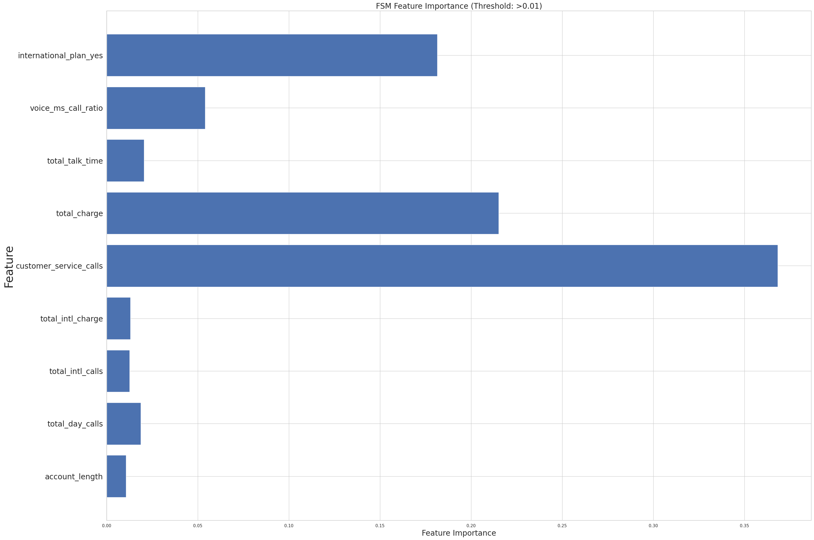

# SyriaTel Customer churn prediction

## Overview
SyriaTel, a leading telecommunications company, is facing a significant challenge with customer churn. Churn is when customers decide to terminate their subscriptions with SyriaTel, resulting in revenue loss. To address this issue, SyriaTel aims to build a predictive model to identify customers who are likely to churn. By proactively targeting these at-risk customers with retention strategies, SyriaTel hopes to reduce churn rates and retain valuable customers.

## Problem Statement
Can we predict customer churn for SyriaTel and identify the key factors driving churn, enabling the company to implement effective retention strategies?

## Data Science Process Used:
The Data Science Process that is adhered to in this analysis is the CRISP-DM Process.

### 1. Business Understanding
Telecom companies prioritize acquiring and retaining subscribers. Customer churning is a major concern in the competitive telecom sector, impacting companies like Syriatel. To address churn effectively, telecom businesses must recognize its underlying factors and predict them accurately. Businesses can proactively identify customers at risk of leaving and incorporate personalized retention strategies. Proactive churn management reduces revenue losses and improves customer satisfaction.

### 2. Data Understanding

##### What Data Did We Use?
The SyriaTel Dataset was retrieved from [Kaggle](https://www.kaggle.com/becksddf/churn-in-telecoms-dataset), and it is also available in the "data" folder of this repository, in form of a csv file. It contains various information on customers. The data includes various details like the state the customer is from, how long they've been a customer, whether they have an international plan or voice mail plan, how many customer service calls they've made, and much more.

### 3. Data Preparation:
In this stage, data is transformed, cleaned, and preprocessed to make it suitable for analysis. This included:
* Data Type conversion 
* Dealing with multicollinearity 
* Splitting the data.
  
### 4. Modeling

To predict churn, multiple classification models were explored:
* Logistic Regression (Baseline model)
* Random Forest Classifier
* Gradient Boosting Classifier

The hyperparameters were also fine-tuned to improve the model performance.

##### Model Evaluation:

A combination of metrics such as accuracy, precision (Assessed the correctness of churn predictions), recall (Focused on identifying as many churning customers as possible), F1-score, and ROC- AUC (Measured the ability to distinguish between churn and non-churn customers) was used to evaluate the performance of the model and ensure that it met the business requirements and goals of the telecom company.

After tuning, Gradient Boosting achieved the best balance between recall (81.25%) and precision (95.12%), making it the most effective model for predicting churn, indicating effective identification of churn cases while minimizing false positives.

Additionally, the key features that were shown to influence whether a customer would churn or not can be seen in the bar plot displayed below.

## Conclusions 
Factors such as the number of customer service calls, whether the customer has an international plan, and the total day's minutes and charges were significant predictors of customer churn. Interestingly, the findings also showed that customers with an international plan are more likely to churn.

### Recommendations
Based on our findings, I recommend SyriaTel to:
- **Enhance customer support:**  High customer service calls indicate dissatisfaction—improving support could reduce churn.
- **Provide loyalty incentives for high spenders:** Offering discounts or personalized plans for customers with high charges could increase retention.
- **Targeted interventions:** Using predictive insights to proactively reach out to high-risk customers before they churn.

~THE END~